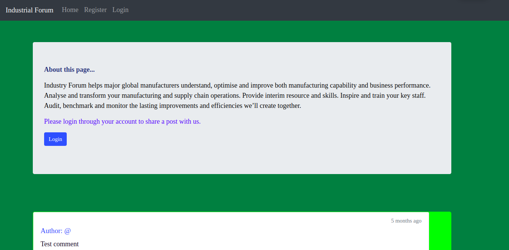
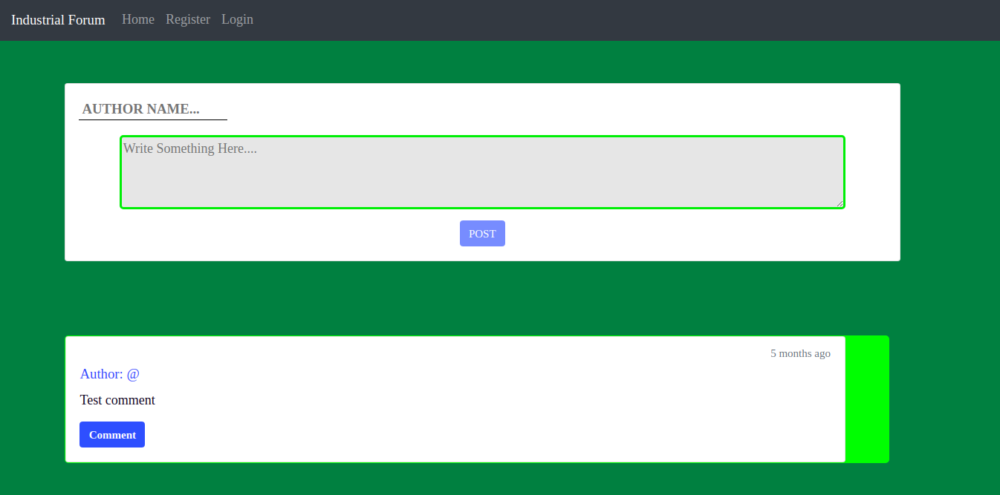

# Industrial-Forum
A Web-based application that allows users to login to that portal and post something about the
industry. Other users can view the posts and comment on the post.
Built the application using React, bootstrap, CSS at front-end, MongoDB for storing data, Express,
Node.js at back-end, and Axios as an HTTP client for making HTTP Requests





### Application runs on :-
- (Client-Side) "http://localhost:3000"
- (backend) "http://localhost:8000"
### Dependencies:
   -  **axios**
   -  **concurrently**
   -  **express**
   -  **mongoose**
   -  **morgan**
   -  **react-bootstrap**
   -  **react-router-dom**
   -  **bootstrap**
## To run the application on local server:
  
```
cd <directory_name>
npm run dev
```
  > This will start the server and client side concurrently at http://localhost:3000
 ### Example of some of the page's url:
   - Signup page:http://localhost:3000/signup
   - Login page:http://localhost:3000/login
   - Posting Forum:http://localhost:3000/forum
